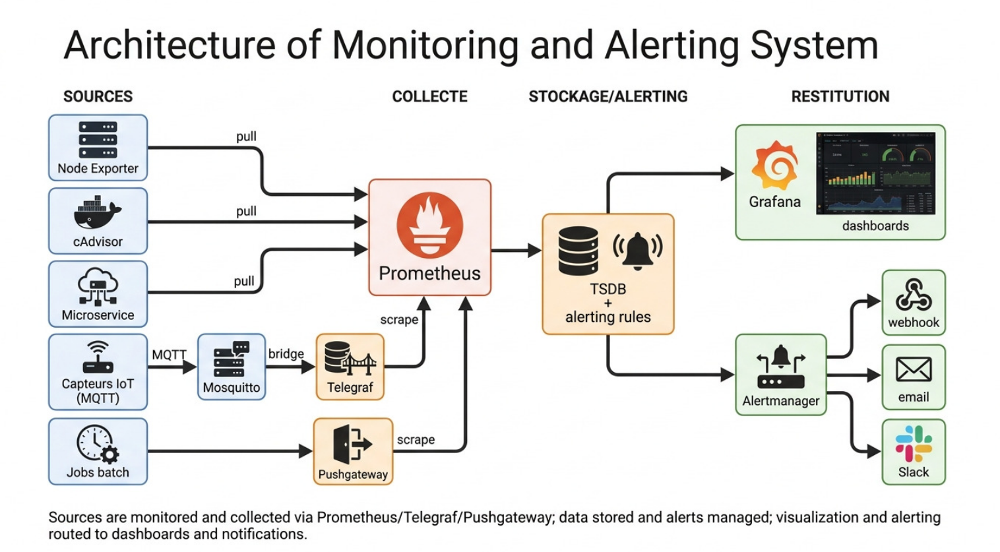
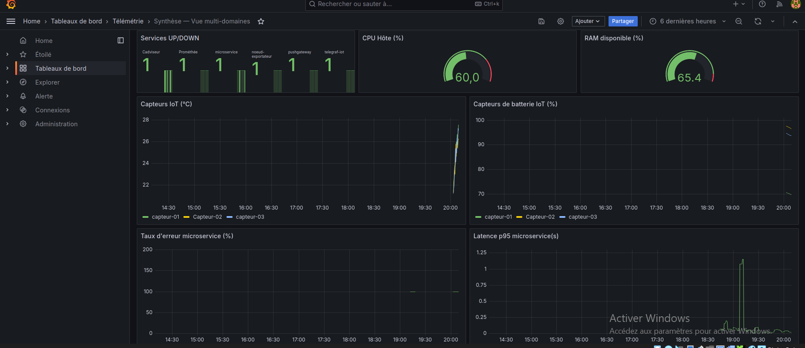
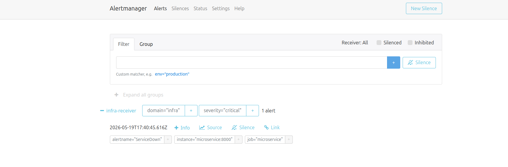

# 📡 Système de Supervision de Télémétrie

> Plateforme open-source de collecte, stockage, alerting et visualisation de métriques multi-domaines — infrastructure IT, IoT industriel et microservices applicatifs.

**Projet académique** — Mastère Expert IT (Réseaux, Systèmes & Cybersécurité) — École IRIS Paris  
**Référence** : PRJ-TEL-2026-001

---

## 🎯 Résultats clés

| Indicateur | Valeur |
|---|---|
| Services déployés | 10 conteneurs Docker |
| Domaines supervisés | 3 (Infrastructure, IoT, Applicatif) |
| Délai de détection d'incident | ~70 secondes (objectif < 2 min ✅) |
| Règles d'alerting | 8 règles sur 3 domaines |
| Dashboards Grafana | 4 dashboards provisionnés automatiquement |
| Rétention des données | 15 jours / 10 Go max |
| Déploiement | 1 seule commande (`docker compose up -d`) |

---

## 🏗️ Architecture



La plateforme s'organise en **4 couches découplées** :

| Couche | Rôle | Composants |
|---|---|---|
| **Sources** | Exposer les métriques | Node Exporter, cAdvisor, Microservice FastAPI, Capteurs IoT |
| **Collecte** | Récupérer et centraliser | Prometheus (pull), Telegraf (bridge MQTT), Pushgateway |
| **Stockage/Alerting** | Persister et évaluer | Prometheus TSDB, Alertmanager |
| **Restitution** | Afficher et notifier | Grafana (dashboards), Webhook receiver |

> **Pourquoi le modèle Pull ?** Prometheus va chercher les métriques lui-même toutes les 15 secondes. Si une cible ne répond plus, il le détecte immédiatement — pas besoin d'attendre que la cible signale sa propre panne.

---

## 🧱 Stack technique

| Composant | Version | Rôle | Pourquoi ce choix |
|---|---|---|---|
| Prometheus | 2.54 | Scraping + TSDB | Standard de fait, modèle pull, PromQL puissant |
| Alertmanager | 0.27 | Routage des alertes | Déduplication native, routage par domaine |
| Grafana | 11.2 | Dashboards | Provisioning déclaratif, vaste écosystème |
| Telegraf | 1.32 | Bridge MQTT → Prometheus | Plugin natif mqtt_consumer, zéro code custom |
| Mosquitto | 2.0 | Broker MQTT | Référence open-source légère, MQTT 3.1.1/5.0 |
| Docker Compose | v2 | Orchestration | Reproductible, démarrage en une commande |
| FastAPI + Python | 3.12 | Microservice instrumenté | Instrumentation directe via prometheus_client |

---

## 🚀 Démarrage rapide

**Prérequis** : Docker Engine 24+ et Docker Compose v2

```bash
git clone https://github.com/thierno-mbaye/telemetrie-supervision
cd telemetrie-supervision
docker compose up -d
```

La plateforme est opérationnelle en moins de 2 minutes. Tous les dashboards Grafana se chargent automatiquement sans aucune configuration manuelle.

**Lancer le simulateur IoT** (dans un terminal séparé) :

```bash
pip install paho-mqtt
MQTT_BROKER=localhost python3 microservice/simulator.py
```

---

## 🌐 Accès aux interfaces

| Service | URL | Credentials |
|---|---|---|
| Grafana | http://localhost:3000 | admin / admin123 |
| Prometheus | http://localhost:9090 | — |
| Alertmanager | http://localhost:9093 | — |
| Pushgateway | http://localhost:9091 | — |
| Microservice | http://localhost:8000 | — |

---

## 📊 Dashboards Grafana



### Infrastructure — Supervision
- CPU Usage % en temps réel par hôte
- RAM disponible %
- Statut UP/DOWN de tous les services
- Métriques réseau (bande passante)

### IoT — Supervision capteurs
- Température par capteur (°C) avec variation sinusoïdale
- Niveau batterie (%) avec décharge progressive
- Vibration avec détection de pics aléatoires (5% de probabilité)
- Pression atmosphérique (hPa)

### Docker — Métriques conteneurs
- CPU par conteneur (%)
- Mémoire par conteneur (MB)
- Nombre de conteneurs actifs

### Microservice — Applicatif RED
Instrumentation selon la **méthode RED** (Rate, Errors, Duration) :
- **Rate** : taux de requêtes par seconde
- **Errors** : taux d'erreurs 5xx (%)
- **Duration** : latence p95 en secondes

### Synthèse — Vue multi-domaines
Vue unifiée des 3 domaines sur une seule page : services UP/DOWN, CPU, RAM, IoT et microservice.

---

## 🚨 Alerting



### 8 règles d'alerting actives sur 3 domaines

| ID | Alerte | Domaine | Condition | Sévérité |
|---|---|---|---|---|
| AL-01 | ServiceDown | Infrastructure | Service injoignable > 1 min | critical |
| AL-02 | CPUElevé | Infrastructure | CPU > 80% pendant 2 min | warning |
| AL-03 | MémoireInsuffisante | Infrastructure | RAM < 15% pendant 2 min | critical |
| AL-04 | DisquePresquePlein | Infrastructure | Disque < 20% pendant 5 min | warning |
| AL-05 | TempératureCritique | IoT | Temp > 40°C pendant 1 min | critical |
| AL-06 | BatterieFaible | IoT | Batterie < 20% pendant 2 min | warning |
| AL-07 | TauxErreurÉlevé | Applicatif | Erreurs 5xx > 5% pendant 2 min | critical |
| AL-08 | LatenceÉlevée | Applicatif | p95 > 1s pendant 2 min | warning |

### Routage par domaine
Chaque alerte est routée vers un canal distinct selon son domaine (`infra-receiver`, `iot-receiver`, `app-receiver`). Les alertes critiques inhibent automatiquement les warnings de la même instance.

### Délai de détection mesuré
```
Scrape en échec détecté   :  0 — 15 secondes
Condition for: 1m tenue   :  60 secondes
Groupement Alertmanager   :  10 secondes
─────────────────────────────────────────
Total mesuré              :  ~70 secondes  ✅ (< 2 minutes)
```

---

## 📡 Flux IoT — De la mesure à Grafana

```
Capteur (Python) → publie JSON sur MQTT
    → Mosquitto (broker) distribue
        → Telegraf souscrit, traduit en métriques Prometheus
            → Prometheus scrape toutes les 15s
                → Grafana affiche en temps réel
```

**3 capteurs simulés** : `salle-serveurs`, `datacenter`, `atelier-iot`  
**4 métriques** : température, pression, vibration, batterie

---

## 🔌 Extensibilité — Ajouter un capteur sans modifier l'architecture (BF-12)

```bash
docker exec mosquitto mosquitto_pub -h localhost -t "sensors/capteur-99/telemetry" \
  -m '{"device_id":"capteur-99","location":"nouveau-site","temperature":22.0,"pression":1013.0,"vibration":0.3,"batterie":95.0}'
```

Le nouveau capteur apparaît **automatiquement dans Grafana en moins de 30 secondes** — sans modifier un seul fichier de configuration.

---

## 📁 Structure du projet

```
telemetrie-supervision/
├── docker-compose.yml          # Orchestration des 10 services
├── prometheus/
│   ├── prometheus.yml          # Configuration scraping (15s)
│   └── rules.yml               # 8 règles d'alerting PromQL
├── alertmanager/
│   └── alertmanager.yml        # Routage par domaine et sévérité
├── grafana/
│   └── provisioning/
│       ├── datasources/        # Datasource Prometheus (auto)
│       └── dashboards/         # 4 dashboards JSON versionnés
├── mosquitto/
│   └── mosquitto.conf          # Broker MQTT
├── telegraf/
│   └── telegraf.conf           # Bridge MQTT → Prometheus
├── microservice/
│   ├── main.py                 # FastAPI instrumenté méthode RED
│   ├── simulator.py            # Simulateur 3 capteurs IoT
│   ├── requirements.txt
│   └── Dockerfile
└── screenshots/                # Captures de validation (BF-01 à BF-12)
```

---

## 🎓 Compétences démontrées

- **Conteneurisation** : orchestration Docker Compose multi-services
- **Observabilité** : modèle pull, séries temporelles, PromQL
- **IoT** : protocole MQTT, bridge vers stack de monitoring
- **Instrumentation** : méthode RED sur microservice Python/FastAPI
- **Alerting** : règles PromQL, routage par domaine, déduplication
- **Sécurité** : variables d'environnement, accès anonyme désactivé, exposition minimale des ports
- **Reproductibilité** : déploiement en une commande, provisioning déclaratif

---

## 👨‍💻 Auteur

**Thierno Mbaye**  
Étudiant Mastère Expert IT — Réseaux, Systèmes & Cybersécurité  
École IRIS Paris

🌐 Portfolio : [thierno-mbaye.github.io](https://thierno-mbaye.github.io)  
💼 LinkedIn : [linkedin.com/in/thierno-mbaye](https://linkedin.com/in/thierno-mbaye)  
📧 thiernomb1801@gmail.com
